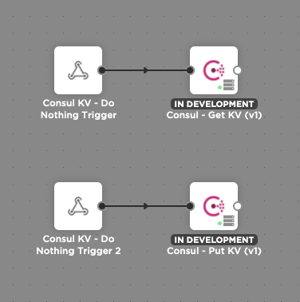

# Consul Steps

This integration allows you to use Consul KV in xMatters. It contains two steps, **Consul - Get KV** and **Consul - Put KV**.

---------

<kbd>
  
</kbd>

---------

# Files

* [ConsulSteps.zip](ConsulSteps.zip) - Workflow zip file with the step and example flow
* [consul.png](/consul.png) - Consul logo

# How it works
These steps alllow you to get and put values to Consul KV.

# Installation

## Consul Setup
Install the xMatters Agent if needed.

## xMatters Setup
1. Download the [Consul.zip](Consul.zip) file onto your local computer
2. Navigate to the Workflows tab of your xMatters instance
3. Click Import, and select the zip file you just downloaded
4. Create an Endpoint pointed at your Consul instance in xMatters. (This should not include the /v1/ e.g. `127.0.0.1:8500`)

## Usage

## Consul - Get KV

### Inputs

| Name  | Required? | Min | Max | Help Text | Default Value | Multiline |
| ----- | ----------| --- | --- | --------- | ------------- | --------- |
| Key | Yes | 0 | 2000 | Key of the value to get from Consul | | No |

### Outputs

| Name | Description |
| ---- | ----------  |
| Value | Value of the key in Consul KV |
| Success | If the value was successfully found or not. Either (true) or (false) |

## Consul - Put KV

### Inputs

| Name  | Required? | Min | Max | Help Text | Default Value | Multiline |
| ----- | ----------| --- | --- | --------- | ------------- | --------- |
| Key | Yes | 0 | 2000 | Key to set in Consul KV | | No |
| Value | Yes | 0 | 2000 | Value to set in Consul KV | | No |

### Outputs

| Name | Description |
| ---- | ----------  |
| Success | If the value was successfully found or not. Either (true) or (false) |

## Example Flow

In the Example Flow **Consul - Get KV** and **Consul - Put KV** Steps are called from HTTP Triggers.

